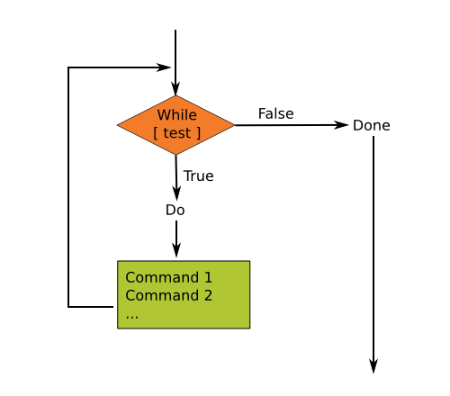

# Loops !

Round and round we go.

## Introduction

Bash loops are very useful. In this section of our Bash Scripting Tutorial we'll look at the different loop formats available to us as well as discuss when and why you may want to use each of them.

Loops allow us to take a series of commands and keep re-running them until a particular situation is reached. They are useful for automating repetitive tasks.

There are 3 basic loop structures in Bash scripting which we'll look at below. There are also a few statements which we can use to control the loops operation.

## While Loops

One of the easiest loops to work with is while loops. They say, **while** an expression is true, keep executing these lines of code. They have the following format:

```
while [ <some test> ]
do
    <commands>
done
```

You'll notice that similar to if statements the test is placed between square brackets [ ].



In the example below we will print the numbers 1 through to 10:

```bash
#!/bin/bash
# Basic while loop
# while_loop.sh
counter=1

while [ $counter -le 10 ]
do
    echo $counter
    ((counter++))
done

echo All done
```

Let's break it down:

- We'll initialise the variable counter with it's starting value.
- While the test is true (counter is less than or equal to 10) let's do the following commands.
- We can place any commands here we like. Here echo is being used as it's an easy way to illustrate what is going on.
- Using the double brackets we can increase the value of counter by 1.
- We're at the bottom of the loop so go back to line 5 and perform the test again. If the test is true then execute the commands. If the test is false then continue executing any commands following done.

```
bash-3.2$ ./while_loop.sh
1
2
3
4
5
6
7
8
9
10
All done
bash-3.2$
```

> Tip
>
> A common mistake is what's called an **off by one** error. In the example above we could have put `-lt` as opposed to `-le` (less than as opposed to less than or equal). Had we done this it would have printed up until 9. These mistakes are easy to make but also easy to fix once you've identified it so don't worry too much if you make this error.

## Until Loops

The until loop is fairly similar to the while loop. The difference is that it will execute the commands within it until the test becomes true.

```
until [ <some test> ]
do
  <commands>
done
```

```bash
#!/bin/bash
# Basic until loop
counter=1
until [ $counter -gt 10 ]
do
    echo $counter
    ((counter++))
done
echo All done
```

As you can see in the example above, the syntax is almost exactly the same as the while loop (just replace while with until). We can also create a script that does exactly the same as the while example above just by changing the test accordingly.

So you may be asking, 'Why bother having the two different kinds of loops?'. We don't necessarily. The while loop would be able to handle every scenario. Sometimes, however, it just makes it a little easier to read if we phrase it with until rather than while. Think about the following statement:

**Leave the towel on the line until it's dry.
**
We could have said:

**Leave the towel on the line while it is not dry.
**
Or:

**Leave the towel on the line while it is wet.
**
But they just don't seem as elegant and easy to understand. So by having both while and until we can pick whichever one makes the most sense to us and as a result, end up with code that is easier for us to understand when we read it.

> Tip
>
> We should always strive for clean, obvious and elegant code when writing our Bash scripts.

## For Loops

The for loop is a little bit different to the previous two loops. What it does is say for each of the items in a given list, perform the given set of commands. It has the following syntax.

```
for var in <list>
do
  <commands>
done
```

The for loop will take each item in the list (in order, one after the other), assign that item as the value of the variable var, execute the commands between do and done then go back to the top, grab the next item in the list and repeat over.

The list is defined as a series of strings, separated by spaces.

Here is a simple example to illustrate:

```bash
#!/bin/bash
# Basic for loop
names='Stan Kyle Cartman'
for name in $names
do
echo $name
done
echo All done
```

Let's break it down:

- Create a simple list which is a series of names.
- For each of the items in the list $names assign the item to the variable $name and do the following commands.
- echo the name to the screen just to show that the mechanism works. We can have as many commands here as we like.
- echo another command to show that the bash script continued execution as normal after all the items in the list were processed.

```
bash-3.2$ ./for_loop.sh
Stan
Kyle
Cartman
All done
bash-3.2$
```

## Ranges

We can also process a series of numbers

```bash
#!/bin/bash
# Basic range in for loop
# for_loop_series.sh
for value in {1..5}
do
echo $value
done
echo All done
```

- It's important when specifying a range like this that there are no spaces present between the curly brackets { }. If there are then it will not be seen as a range but as a list of items.

```
bash-3.2$ ./for_loop_series.sh
1
2
3
4
5
All done
bash-3.2$
```

When specifying a range you may specify any number you like for both the starting value and ending value. The first value may also be larger than the second in which case it will count down.

It is also possible to specify a value to increase or decrease by each time. You do this by adding another two dots ( .. ) and the value to step by.

```bash
#!/bin/bash
# Basic range with steps for loop
# for_loop_stepping.sh
for value in {10..0..2}
do
echo $value
done
echo All done
```

One of the more useful applications of for loops is in the processing of a set of files. To do this we may use wildcards. Let's say we want to convert a series of `.html` files over to `.php` files.

```bash
#!/bin/bash
# Make a php copy of any html files
# convert_html_to_php.sh
for value in $1/*.html
do
cp $value $1/$( basename -s .html $value ).php
done
```

## Controlling Loops: Break and Continue

Most of the time your loops are going to through in a smooth and orderly manner. Sometimes however we may need to intervene and alter their running slightly. There are two statements we may issue to do this.

### Break

The break statement tells Bash to leave the loop straight away. It may be that there is a normal situation that should cause the loop to end but there are also exceptional situations in which it should end as well. For instance, maybe we are copying files but if the free disk space get's below a certain level we should stop copying.

```bash
#!/bin/bash
# Make a backup set of files
# copy_files.sh

for value in $1/*
do
used=$( df $1 | tail -1 | awk '{ print $5 }' | sed 's/%//' )
if [ $used -gt 90 ]
then
echo Low disk space 1>&2
break
fi
cp $value $1/backup/
done
```

## Continue

The continue statement tells Bash to stop running through this iteration of the loop and begin the next iteration. Sometimes there are circumstances that stop us from going any further. For instance, maybe we are using the loop to process a series of files but if we happen upon a file which we don't have the read permission for we should not try to process it.

```bash
#!/bin/bash
# Make a backup set of files
for value in $1/*
do
if [ ! -r $value ]
then
echo $value not readable 1>&2
continue
fi
cp $value $1/backup/
done
```

## Select

The select mechanism allows you to create a simple menu system. It has the following format:

```
select var in <list>
do
<commands>
done
```

When invoked it will take all the items in list (similar to other loops this is a space separated set of items) and present them on the screen with a number before each item. A prompt will be printed after this allowing the user to select a number. When they select a number and hit enter the corresponding item will be assigned to the variable var and the commands between do and done are run. Once finished a prompt will be displayed again so the user may select another option.

A few points to note:

- No error checking is done. If the user enters something other than a number or a number not corresponding to an item then var becomes null (empty)
- If the user hits enter without entering any data then the list of options will be displayed again.
- The loop will end when an EOF signal is entered or the break statement is issued.
- You may change the system variable PS3 to change the prompt that is displayed.

Here is a simple example to illustrate it's usage:

```bash
#!/bin/bash
# A simple menu system
names='Kyle Cartman Stan Quit'
PS3='Select character: '
select name in $names
do
if [ $name == 'Quit' ]
then
break
fi
echo Hello $name
done
echo Bye
```

Let's break it down:

- Set up a variable with the list of characters and a last option which we may select to quit. Note that the items are separated by a space.
- Change the value of the system variable PS3 so that the prompt is set to something a little more descriptive. (By default it is #?)
- If the last option, 'Quit', is selected then break out of the select loop.
- Print out a message just to demonstrate the mechanism has worked. You may have as many commands here as you like.
- Print a message just to show that the script has continued as normal after the select loop.

And now let's run the Bash script:

```
bash-3.2$ ./select_example.sh
1) Kyle
2) Cartman
3) Stan
4) Quit
Select character: 1
Hello Kyle
Select character: 2
Hello Cartman
Select character: 3
Hello Stan
Select character: 4
Bye
bash-3.2$
```

## Summary

> Stuff We Learnt

- while do done :
  Perform a set of commands while a test is true.
- until do done :
  Perform a set of commands until a test is true.
- for do done :
  Perform a set of commands for each item in a list.
- break :
  Exit the currently running loop.
- continue :
  Stop this iteration of the loop and begin the next iteration.
- select do done :
  Display a simple menu system for selecting items from a list.

> Important Concepts

- Clarity :
  There are several Bash loop mechanisms. Pick the one which makes your code the easiest to follow.
- Planning :
  Now that your scripts are getting a little more complex you will probably want to spend a little bit of time thinking about how you structure them before diving in.

## Activities

Now we have quite a collection of tools under our belt, we can tackle some more interesting problems.

- Create a simple script which will print the numbers 1 - 10 (each on a separate line) and whether they are even or odd.
- Write a Bash script which will take a single command line argument (a directory) and will print each entry in that directory. If the entry is a file it will print it's size. If the entry is a directory it will print how many items are in that directory.
- Create a command line version of the game Mastermind. Instead of coloured marbles you could use letters or numbers or be creative and find another way.
- Create a command line version of the game Tic Tac Toe. Make it so you can play against the computer.
