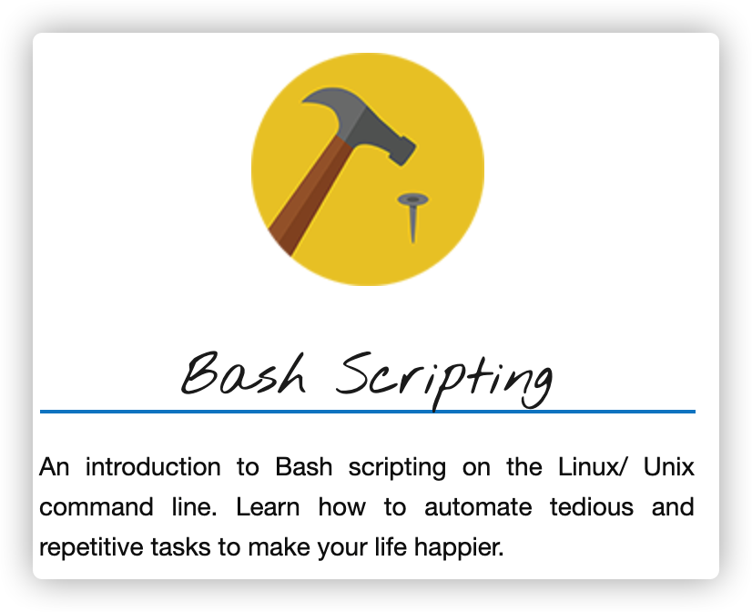

# Learn How To Write Bash Scripts on Unix/Linux.

<!--  -->

 

## Introduction

This repo is intended to give you a solid foundation in how to write Bash scripts, to get the computer to do complex, repetitive tasks for you.

Most learning materials are from Ryan Chadwick who have been teaching Linux to students for over 10 years now. You can find his website here at https://ryanstutorials.net/.

You won't be a bash guru at the end but you will be well on your way and armed with the right knowledge and skills to get you there if that's what you want (which you should). It is also a good practice for reviewing work.

Bash scripts are used by Systems Administrators, Programmers, Network Engineers, Scientists and just about anyone else who uses a Linux/ Unix system regularly.
No matter what you do or what your general level of computer proficiency is, you can generally find a way to use Bash scripting to make your life easier.

Bash is a command line language. The name stands for `Bourne Again SHell`. It is an open source version of the Bourne Shell and was first released in 1989.

BASH is the default shell on most Linux distributions and Apple's macOS (formerly OS X). Recently, a version has also been made available for Windows 10 (WSL1/2).

## Outlines

This Bash scripting tutorial is divided into 8 sections plus few case studies realted to IT administration and engineering for data analytics and machine learning.

In general I recommend you work through them in order but if you've come here just to learn about a specific topic then who am I to slow you down, just head straight on over.

1. What is a Bash Script - What are they, how do they work and how to run them.
2. Variables - Store data temporarily for later use.
3. Input - Different ways to supply data and directions to your Bash script.
4. Arithmetic - Perform various arithmetic operations in your Bash script.
5. If Statements - How to make decisions within your Bash script.
6. Loops - A variety of ways to perform repetitive tasks.
7. Functions - Reuse code to make life easier.
8. User Interface - Make your scripts user friendly.
9. Case Study

Bash scripting relies on an understanding of the Linux Command Line. If you are not confident on the Linux Command Line I suggest you start by going through the [Linux Tutorial](https://ryanstutorials.net/linuxtutorial/).

## Structure

The best way to learn Bash Scripting is as a series of small, easy to manage steps.
This tutorial is organised as such, with each section building upon the knowledge and skills learned in the previous sections. If you work through them in order, read them fully (there is a fair bit of material but it is important for getting a proper understanding) and practice on the command line as you go I believe you should have a fairly pleasant and smooth journey to Bash scripting mastery.

99 times out of 100 when a student has troubles with this stuff I find that it is not that they are incapable but that they were lazy and didn't read the material fully.

Each section is structured in the following format:

- An introduction outlining what you will learn in that section.
- Detailed material including extensive examples.
- A summary of the most important concepts.
- A set of activities to help you solidify your knowledge and skills.

Think of the activities not as tutorial questions (such as you may get in a class at school) but as direction on where to explore in the Linux environment to benefit from your new knowledge and skills.
Treat the activities as a starting point for exploration. The further you take it, the better you will do. (How well you do and how far you go depends on how unlazy you are.)

## General House Rules

- I'll refer to Linux in the following pages, whenever I do, assume I'm actually saying Unix/ Linux. Linux is an offshoot of Unix and behaves pretty much exactly the same.
- Whenever you see `<something>`, what this means is that you are to replace this with something useful. Replace the whole thing (including the < and >). If you see something such as <n> then it usually means replace this with a number.
- Whenevery you see `[something]` this usually means that this something is optional. When you run the command you may put in the something or leave it out.

## Problem Solving and Creative Thinking

If you wish to succeed with Bash scripting then there are two things you need, Problem solving and Creative thinking. Here are some basic pointers to help you along the way.

If you wish to succeed with Bash scripting then there are two things you need, Problem solving and Creative thinking. Here are some basic pointers to help you along the way.

- **Explore and experiment**. Remember, you're learning how to assemble a set of building blocks and with them you can build almost anything. The examples you will find are intended to be an illustration of how they work, not the only thing you can do with them. I encourage you to tweak the examples and see how they behave. This will give you a much better understanding on how they work. You will have a lot of questions along the way along the lines of "What if....?" and "Can I ...?" to which I say, "Give it a go and see what happens." The worst you can really get is an error message. In which case you read the error message to understand why it didn't work, then have another go. Don't hold back!

- **Read carefully** and don't skip over the fine details. I can't stress this enough. The fine details are important and are often the difference between your script working and not working. If something isn't working then re-read the material carefully and re look over what you have typed in to make sure you haven't make a silly little typo.

## Reference Link:

- [Ryan Chadwick Problem Solving Skills tutorial.](https://ryanstutorials.net/bash-scripting-tutorial/)

## Disclaimer

Unfortunately, in this crazy and litigous world we now live in, one has to keep themselves covered so here is my disclaimer.

To the best of my knowledge, the material contained within these pages is correct. I make no guarantees however.
I also take no responsibility for any damage you may do based upon knowledge gained from here (even though the chances of doing so are relatively small at best).
Please use common sense when using any of the knowledge and skills gained from using this material.
